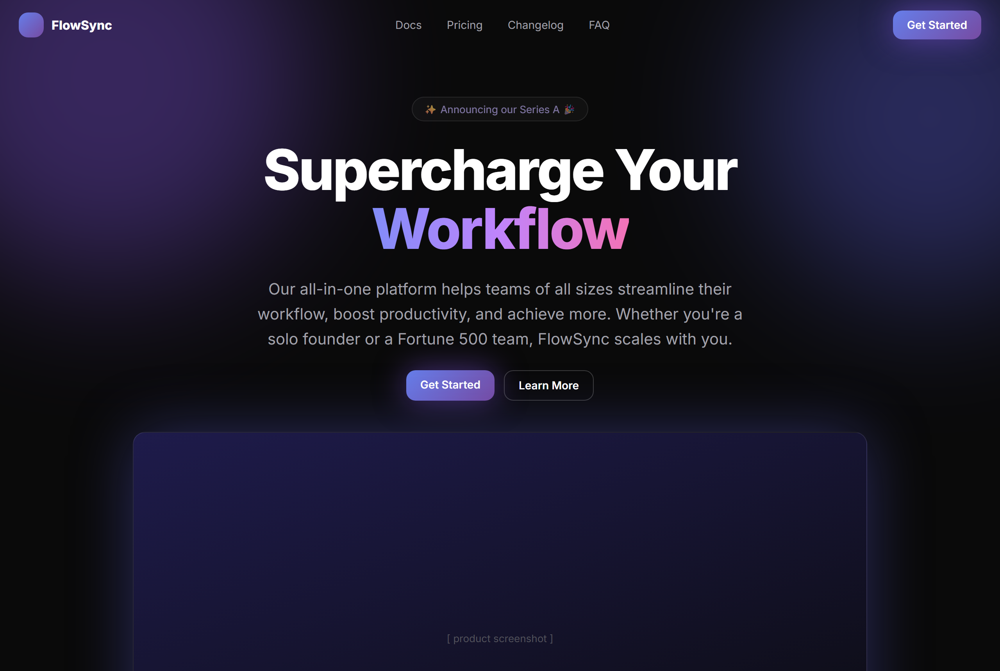
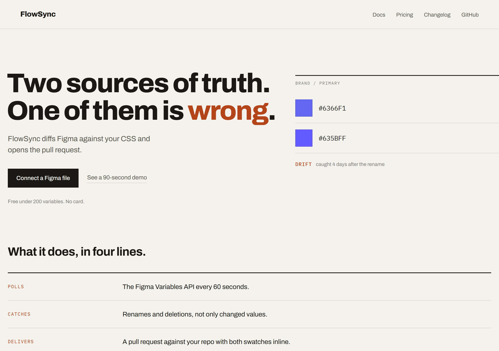

<div align="center">

# stop-design-slop

**An agent skill that makes a website stop looking AI-generated.**

Strips the AI fingerprints without restyling your site. Rebuilds around a committed art direction only if you ask.

[](LICENSE)
[](#install)
[](#install)
[](#the-diagnostic-half)
[](#the-generative-half)
[](CONTRIBUTING.md)

</div>

---

Open five new startup sites and you meet the same page. A pill badge with a sparkle floats above a centered hero whose headline has exactly one gradient word. Three feature cards sit below, each holding a Lucide icon in a small indigo square. The trust bar claims 10,000+ teams on a domain registered last Tuesday, and the whole thing glows purple over `#0a0a0a` in Inter.

Your visitors recognize that page in about five seconds and stop believing anything below the fold.

## Two jobs, and only one of them is safe piecemeal

"This looks AI-generated" hides two different requests, and mixing them is what breaks pages.

**Artifacts are always safe to remove.** A Lovable badge, a "Create Next App" tab title, lorem ipsum, a fabricated testimonial, a dead `href="#"`, a six-fingered hero image. These are wrong whatever your design direction, so deleting them can only help. That is the **CLEAN pass**, and it runs by default.

**Style defaults are not.** Inter, indigo-500, the centered hero, `rounded-xl` on everything. Each is a *choice* that happens to be the statistical average, and changing one in isolation produces incoherence, which reads worse than consistent genericness. These need an art direction, so CLEAN reports them and leaves them alone.

```text
/stop-design-slop            → CLEAN. Strips artifacts. Never touches your design system.
/stop-design-slop essential  → Tier 1 only. Cannot make your site worse under any taste.
/stop-design-slop redesign   → Commits to a direction and rebuilds from tokens.
```

CLEAN may not edit theme tokens, `font-family`, the palette, the radius or shadow scale, or layout structure. That single constraint is what makes it safe to run on a site somebody else designed, or an hour before launch.

## Why deleting the style tells makes it worse

v1 of this skill was a 284-item catalog of AI design tells, and it told the agent to fix them all one at a time, style defaults included. A user ran it and reported the result looked **more** AI-generated than the original. They were right, for four reasons now documented in [method.md](references/method.md).

**Coverage.** A 284-item ban list constrains 284 decisions. A page makes thousands: line-height, measure, hover easing, focus ring, caption style, table rules, empty states. Every decision the list does not name reverts to the model's default. Silence in a design system *is* the default, so a subtractive audit can never win however long it grows.

**Negation promotes the runner-up.** Banning the most common option does not flatten the distribution, it promotes second place. Everyone running the same ban list lands on the same second choice. "Don't use Inter" arrives at Space Grotesk, which is tell #95. "Don't center the hero" arrives at the 50/50 split, which is tell #7 and still symmetrical. The escape hatch has a spec sheet.

**Patchwork.** Thirty tells fixed as thirty independent edits produce thirty unrelated decisions. The generic original was at least coherent: one font, one radius, one accent, applied everywhere. Afterward you have a different font, three radii, and a flat section beside a rounded one. Incoherence reads as broken, and broken is worse than generic.

**The metric was wrong.** A score that only counts tells has its optimum at a flat gray page with a system font and no motion. Zero tells, zero decisions. Absence of decisions is itself the AI signature.

So style tells stopped driving the fix. In CLEAN they are reported rather than applied. In REDESIGN they appear as diagnosis before the work and as lint assertions after it, while a committed direction sits in between.

## Five tiers of removal

Every tell is assigned a tier, ordered by how much judgment it needs and how much it can change. Run as deep as you want.

| Tier | Name | What it does | Can it make the site worse? |
|---|---|---|---|
| **1** | **ESSENTIAL** | Builder badges, default titles and favicons, placeholder text, LLM artifacts, dead links, ghost contact forms, console errors, exposed keys, missing focus states and alt text, failing contrast, absent meta tags | **No.** Under any taste, any direction. |
| **2** | **HONEST** | Fabricated testimonials, invented stats, placeholder logo bars, unsourced ratings, press bars with no coverage, AI-image artifacts | No, but it needs facts from you |
| **3** | **QUIET** | Ambient motion, particles, glow orbs, marquees, count-ups, scroll-jacking, `hover:scale-105`, gradient keywords, emoji icons | Only if you liked the decoration |
| **4** | **CRAFT** | Real punctuation, `text-wrap: balance`, tracking by size, a focus ring in your existing accent, tabular figures, real empty and error states, specific copy | No, though it changes appearance a little |
| **5** | **DIRECTION** | Typeface, palette, radius scale, hero composition, section order | Yes, piecemeal. Reported, never applied. |

```text
/stop-design-slop              tiers 1-4 (default)
/stop-design-slop essential    tier 1 only — the "cannot possibly hurt" pass
/stop-design-slop tier 2       tiers 1-2
/stop-design-slop redesign     tiers 1-4, then commit to a direction
```

**Tier 1 carries a real guarantee.** Every item in it is broken, left over from a generator, or missing. Nothing requires taste or brand knowledge, and nothing you intentionally designed gets touched. After a tier 1 pass the page should look the same, apart from a focus ring appearing on tab and body text gaining contrast. Safe on a site you did not build, an hour before launch.

**Tier 4 is why a clean pass does not go bland.** Removal lowers the Slop Score; craft raises the Commitment Score. Copy rewrites live here and carry more signal per edit than anything else, since readers detect slop through language faster than through layout.

Per-tell breakdown in [clean-pass.md](references/clean-pass.md).

## One hero at four depths

| Before, ~25 tells | Tiers 1 to 2 | Tiers 1 to 4 |
|---|---|---|
|  |  |  |



**Tier 5, the redesign.** Cool paper rather than dark, Archivo rather than Inter, a signal orange derived from the CI changed-flag rather than indigo, zero radius committed everywhere, an asymmetric 7/5 grid rather than a centered stack, a spec list rather than three equal cards, and the diff diagram bleeding past the right edge as the signature move.

**Tiers 1 and 2 leave the design alone.** The glow orbs, the gradient keyword, the sparkle badge, the emoji icons and "Supercharge Your Workflow" all survive, because removing decoration is tier 3 and rewriting copy is tier 4. Only the broken and the untrue went: the `Create Next App` title, the Lovable badge, `href="#"`, lorem ipsum, failing contrast, a missing focus ring, then the Acme Corp logo bar, the invented stat row and "★★★★★ Loved by 10,000+ developers".

The first two screenshots look almost the same, and that is the guarantee working.

**Tiers 3 and 4 go further**, still without touching the typeface, ground, accent hue, radii or layout:

> **Before:** Supercharge Your **Workflow**
> Our all-in-one platform helps teams of all sizes streamline their workflow, boost productivity, and achieve more. Whether you're a solo founder or a Fortune 500 team, FlowSync scales with you.

> **After:** Figma says `#6366F1`. Your CSS says `#635BFF`.
> FlowSync opens a pull request the moment they drift.

[`examples/README.md`](examples/README.md) lists every change by tier, including what tier 5 deliberately left alone. Source: [`hero-before.html`](examples/hero-before.html) · [`hero-tier2.html`](examples/hero-tier2.html) · [`hero-clean.html`](examples/hero-clean.html).

## What REDESIGN does

```
DIAGNOSE  →  BRIEF  →  SPEC  →  REBUILD  →  LINT  →  JUDGE
```

The deliverable is a **`DESIGN.md`** written into your project: 20 to 50 lines, every slot filled with an exact value, no adjectives. Type, color, geometry, space, motion, imagery, copy, plus five named commitments (the focal point, the one element that breaks the container, a signature device repeated in three roles, the decision competitors would never make, and one deliberate exception to your own system).

An empty line in that spec is a decision handed back to the model, which is how genericness gets in.

Then the rebuild happens at the token layer as one atomic change, because coherence cannot be assembled from scattered component edits. Defaults are made **unreachable** rather than discouraged: you define Tailwind's `colors:` rather than `extend:` so the framework palette cannot be referenced at all. Renaming `indigo` to `primary` changes nothing anybody can see.

## Install

An open-standard `SKILL.md` folder, so it drops into any agent that reads skills.

<details open>
<summary><b>Claude Code</b></summary>

```bash
git clone https://github.com/Juuzoe/stop-design-slop ~/.claude/skills/stop-design-slop
```
```powershell
git clone https://github.com/Juuzoe/stop-design-slop "$env:USERPROFILE\.claude\skills\stop-design-slop"
```
Invoke with `/stop-design-slop`.
</details>

<details open>
<summary><b>Codex</b></summary>

```bash
git clone https://github.com/Juuzoe/stop-design-slop ~/.codex/skills/stop-design-slop
```
```powershell
git clone https://github.com/Juuzoe/stop-design-slop "$env:USERPROFILE\.codex\skills\stop-design-slop"
```
Restart Codex, then run `/skills` or type `$stop-design-slop`. For a team-shared install, clone into `.agents/skills/stop-design-slop` at the repo root.
</details>

<details>
<summary><b>Cursor, Gemini CLI, other agents</b></summary>

Clone anywhere and point the agent at `SKILL.md`. No tool is a hard requirement; see [Agent compatibility](SKILL.md#agent-compatibility).
</details>

## Use

```text
/stop-design-slop https://yoursite.com    CLEAN tiers 1-4: strip artifacts, keep the design
/stop-design-slop                         CLEAN, on the current project
/stop-design-slop essential               tier 1 only, the "cannot possibly hurt" pass
/stop-design-slop tier 2                  tiers 1-2
/stop-design-slop redesign                commit to a direction and rebuild from tokens
/stop-design-slop audit-only              diagnosis + plan, changes nothing
/stop-design-slop build                   prevention mode: spec before any code exists
/stop-design-slop quick                   the 63 instant tells, fast diagnosis only
```

The skill will not escalate to a redesign on its own. It finishes the clean pass, reports what a direction would fix, and leaves the decision to you.

In Codex, swap the leading `/` for `$`. In any agent you can also just say "this looks AI-generated, fix it."

## The generative half

**[13 art directions](references/directions.md)**, each specified far enough to build from: display and body typefaces by real name (with free, self-hostable options), tracking and leading conventions, palette strategy with hex values, radius stance, spacing rhythm, the layout signature that identifies the direction, imagery rules, motion policy, copy voice, real example sites, and the specific way each one fails.

Swiss International · Editorial/Magazine · Technical Documentation · Terminal/Code Brutalism · Brutalist/Raw HTML · Neo-Vintage/Print Revival · Warm Organic · High-Contrast Fashion · Utilitarian Tool · Neubrutalist/Toy · Archival Index · Scientific/Data-Forward · Cinematic Dark · Libre/Experimental

Directions are chosen through three filters so different projects land in different places: your brand attributes, what your competitors already occupy, and **what your content can actually support**. That third filter kills the most candidates. Fashion editorial dies without excellent photography; data-forward dies without real data. Picking a direction your content cannot feed produces an empty template.

**[Derivation math](references/derivation.md)** for everything a direction leaves open, executable without taste:

- Source a hue from the brand's own artifact or material, keeping only the hue angle and re-deriving lightness and chroma. Includes a competitive hue audit that tells you mechanically whether your color is invisible.
- Compute the hue's physical chroma ceiling, which decides whether your brand color can carry white text at all. Yellow and green peak at L 0.88 and cannot. Violet peaks at 0.485 and cannot carry black.
- Build a 12-step OKLCH ramp where each step has a stated job, using lightness and chroma ladders reverse-derived from hand-tuned production scales.
- Solve contrast rather than eyeballing it, targeting APCA and asserting WCAG as a hard gate, since the two disagree and you need both.
- Hold saturation while fixing contrast by bisecting lightness at the chroma ceiling. In the worked example that costs 8% of chroma where desaturating would cost 40%.
- Pick and pair typefaces against measured gates: x-height ratio, aperture, stroke contrast, disambiguation of `Il1`, plus the pairing strategies and the one prohibited combination.
- Derive spacing from the type scale rather than inventing values, and radius from the typeface's own geometry.
- Build layered, hue-matched shadows instead of `rgba(0,0,0,.1)`.

**[64 craft details](references/craft-details.md)** (C1–C64) that signal a human hand, each implementable, most in one line. Real punctuation, hanging punctuation, true small caps, tabular figures, `text-wrap: balance` and `pretty`, tracking tuned by size, optical alignment, subgrid card alignment, brand focus rings, styled `::selection`, underline craft, five genuinely distinct control states, empty and error states, grain and material, and the deliberate irregularities that prove somebody chose. Ranked by signal per hour at the end.

**[The art-direction process](references/art-direction.md)**: perception brief, competitor mapping, attribute disambiguation (the step that decides whether you diverge or converge), element-decomposed competitive audit, white-space plot, anti-mood board, cross-category reference import, and three-tier token propagation.

## The diagnostic half

Seven catalogs, 287 numbered tells, used for diagnosis and lint rather than as a repair list.

| Catalog | Tells | For example |
|---|---|---|
| [Structure & layout](references/structure-layout.md) | #1–63 | #1 the "✨ Announcing" pill badge · #10 the hero→logos→features→pricing→FAQ conveyor belt |
| [Color & effects](references/color-effects.md) | #64–93 | #64 untouched indigo-500 · #77 blurred glow orbs |
| [Typography](references/typography.md) | #94–121 | #94 Inter as the only typeface · #107 gradient keyword via `bg-clip-text` |
| [Imagery & icons](references/imagery-icons.md) | #122–153, #285 | #123 six-fingered hero art · #144 emoji as feature icons |
| [Motion & interaction](references/motion-interaction.md) | #154–183 | #154 fade-up on every section · #170 particle backgrounds |
| [Copy & content](references/copy-content.md) | #184–251, #287 | #184 "Supercharge Your Workflow" · #228 "Trusted by 10,000+ teams" |
| [Code & meta](references/code-meta-tells.md) | #252–284, #286 | #252 the Lovable badge · #271 contact forms wired to nothing |

Each catalog ends with a **VOCAB block** of exact greppable strings, so diagnosis works on source before anything renders.

## What it measures, not just what it reads

Prose rules need an agent to recognize a pattern. [`signals.md`](references/signals.md) holds the ones you can compute, which matters because a rule an agent can check against its own output produces compliance, while one it cannot check produces over-correction.

**Layout counters** turn design defaults into numbers: distinct font families (1 is a tell), distinct weights (2 despite a variable font), H1-to-body ratio (under 1.25 is a flat scale), section-padding variance (0 is a metronome), distinct radii, grid columns, elements crossing a section boundary (0 means no tension), accent surface area (should sit between 4% and 12%).

**Copy counters**: blacklist phrase density, headline word count, em dashes per 100 words, unsourced numerals, and invisible characters (`U+200B`, `U+FEFF`), which peer detectors all check and this catalog missed until now.

**Build greps** are exact and instant, so run them first: builder fingerprints, placeholder residue, chat-transcript leakage, secrets in the client bundle.

Burstiness and type-token ratio are included **with their limits stated**. They work as editing prompts and fail as detectors, since burstiness converges toward human levels as models scale and perplexity-based detection misclassifies famous human documents. Low burstiness means go vary your sentence lengths, which is good advice whoever wrote the text. It is never evidence that a page was generated.

## Scoring, on two axes

A single slop score rewards deletion, so the skill scores commitment too.

```
raw              = 3×instant + 2×strong + 1×mild
Slop Index       = round(100 × raw / (raw + 40))     0 to 100
Commitment Score = filled, propagated, nameable decisions
```

The index is reported with a per-category breakdown, because one number hides which half is broken. A page at index 47 carrying 23 of it in copy needs a copy pass, not a redesign.

| Slop | Commitment | Verdict |
|---|---|---|
| high | low | Generic template. The starting point. |
| high | high | Loud but derivative. Fix the tells. |
| **low** | **low** | **Bland. The failure this skill exists to prevent.** |
| low | high | Ship it. |

## What it will not do

- **Every removal gets a replacement.** Name the job an element does and keep that job covered.
- **Never strip all three interaction signifiers.** Shadow, radius and fill are slop tells *and* the primary clickability cues. Remove all three and the page reads unfinished on top of bland, so an interactive element keeps at least two of border, fill, and a hover or focus delta.
- **Conventions stay.** Nav, forms, hierarchy and checkout are load-bearing. Divergence goes into type, color, section order, imagery, microcopy and motion.
- **Accessibility outranks aesthetics**, in every conflict.
- **Your brand stays yours.** If the purple is the actual brand color, it stays, used with more intention.
- **Restraint over reinvention.** Swinging to brutalism because "AI can't do that" produces a different template.

## Already ran a de-slop that made things worse?

Revert to the pre-audit commit rather than repairing forward. The generic original is a better base because it is internally consistent, so token changes propagate predictably through it. Patchwork has no consistent base to propagate from. Keep the diagnosis from the failed run, since detection was never the problem, then write the spec and rebuild. Full recovery steps are in [method.md](references/method.md).

## FAQ

**Will every site using this end up looking the same?** That is the real risk, and four guards exist for it: direction is selected by brand inputs rather than preference, the palette derives from your own source material, the signature move is invented per project, and the skill refuses to run on defaults. If a skill produces one non-slop for everybody, it has manufactured a new default inside one cycle.

**Does it need a browser?** Rendering helps. Without one the skill audits the code, runs the greppable sweep, and states which categories it could not verify rather than guessing.

**My site came out of v0, Lovable or Bolt.** That is the main use case. Catalog 7 strips builder fingerprints and the spec keeps the next build clean.

**Is this anti-AI?** It is anti-default. Build with whatever you like; the skill checks that the result looks like somebody made a decision.

**Can I run it on a site I don't own the design of?** Yes, that is what CLEAN is for. It cannot edit theme tokens, fonts, the palette, the radius scale or layout, so the design system you inherited comes out unchanged.

**Which mode do I want?** CLEAN if the design is fine and the AI fingerprints are the problem, or if you ship soon. REDESIGN when the clean pass finishes and the 5-second test still says "generic", the Commitment Score is under 3, or the lineup test cannot pick your site out of five competitors.

## Contributing

New tells, false positives, better fixes, and additional directions are all welcome. [CONTRIBUTING.md](CONTRIBUTING.md) has the entry format and the severity rubric.

A ⭐ helps other people find this before they ship the pill badge.

## License

[MIT](LICENSE). Use it, fork it, ship it.
