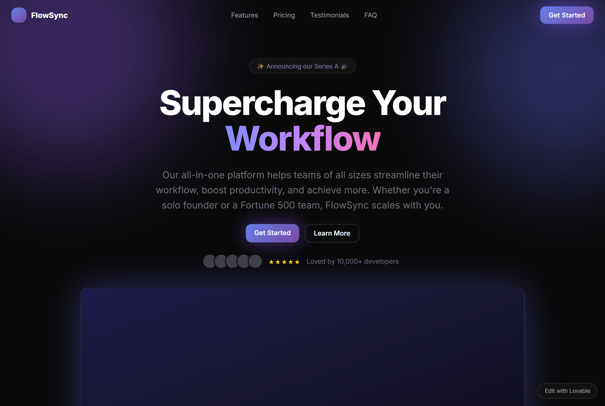
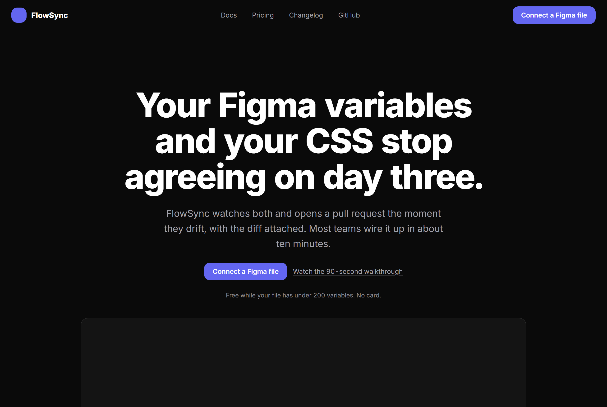

# Worked example: the same hero, before and after

| Before | After tiers 1 to 4 |
|---|---|
|  |  |

Two self-contained HTML files, plus the screenshots above.

- **`hero-before.html`** — a hero carrying about 25 catalogued tells, of the kind a builder emits from a one-line prompt.
- **`hero-clean.html`** — the same page after CLEAN tiers 1 to 4.

## The point of the example

**The design system is unchanged between them.** Both use Inter, a `#0a0a0a` ground, an indigo accent, 12px and 16px radii, a centered single-column layout, and the same three-card grid. No typeface, no hue family, no radius and no layout structure changed.

One qualifier, so the claim stays honest: the button and logo fills went from the `linear-gradient(135deg, #667eea, #764ba2)` stock gradient to solid `#6366f1`. That is tier 3 flattening a decorative gradient (#73), not a palette decision. The hue family is the same, and a redesign would replace it outright.

Every difference is an artifact removed, a falsehood corrected, decoration deleted, or craft added. The after page is still recognizably the same product in the same visual language, and it no longer contains evidence that a machine assembled it.

That gap it does *not* close, namely that the typeface and palette are still framework defaults, is exactly what tier 5 and a redesign are for. This is the honest ceiling of a clean pass.

## Every change, by tier

### Tier 1, ESSENTIAL (cannot make the site worse)
- `<title>Create Next App</title>` becomes a real title (#259)
- `<link rel="icon" href="/vite.svg">` removed (#260)
- "Edit with Lovable" badge removed (#252)
- Every `href="#"` becomes a real route (#269)
- `hello@example.com` becomes a monitored address (#248)
- Lorem ipsum removed from the footer (#248)
- `© 2024` corrected (#250)
- Body text `#71717a` on `#0a0a0a` raised to `#a1a1aa`, which passes 4.5:1 (#68)
- `:focus-visible` ring added, since there was none (#279)
- Meta description and Open Graph tags added (#265, #266)

After tier 1 alone, the page still looks like the before screenshot. That is the guarantee.

### Tier 2, HONEST (needs facts from you)
- "Loved by 10,000+ developers" with five stock avatars and five stars, removed (#5, #228)
- Logo bar reading Acme Corp, TechFlow, Globex, Initech, removed (#14)
- Stat row `10,000+ · 99.9% · 4.9/5 · 24/7`, removed (#16)
- "Bank-level security and enterprise-grade encryption" with no security page behind it, removed (#234)
- Replaced by one honest line: free under 200 variables, no card.

### Tier 3, QUIET (subtractive, visual)
- Two blurred purple glow orbs removed (#77)
- `✨ Announcing our Series A 🎉` pill with `animate-pulse` removed (#1, #175)
- Gradient keyword on "Workflow" reverted to the heading's own color (#107)
- `transform: scale(1.05)` on card hover replaced with a border-color shift (#166)
- Emoji feature icons ⚡🔒📊 removed (#144)
- `ALL-CAPS` eyebrows that only repeated the heading below, removed (#113)
- Colored glow `box-shadow` on the CTA and screenshot removed (#78)

### Tier 4, CRAFT (additive)
- Headline rewritten from "Supercharge Your Workflow" (#184) to a specific problem statement
- Subhead rewritten from the echo-and-hedge formula (#190, #191) to the actual mechanism
- CTAs from "Get Started" and "Learn More" (#216) to "Connect a Figma file" and "Watch the 90-second walkthrough"
- Feature cards from the Blazing Fast / Secure / Analytics triad (#146, #222) to three real mechanisms with numbers
- `text-wrap: balance` on headings, `pretty` on prose (C11, C12)
- `font-variant-numeric: tabular-nums` (C7)
- Underline craft with `text-underline-offset` (C45)
- Styled `::selection` in the existing accent (C38)
- Asymmetric transition timing, faster in than out (C53)
- Non-breaking space in "60 seconds" (C19)
- A stated limitation, a build stamp, and a real updated date (content specificity)

### Tier 5, DIRECTION (reported, not applied)
Still present in `hero-clean.html`, and correctly so:
- Inter as the only typeface (#94), with no pairing (#101)
- Untouched indigo `#6366f1` (#64) on a `#0a0a0a` dark-by-default ground (#65)
- Uniform 12 and 16px radii (#87)
- Centered single-column hero stack (#2) and a three-column feature grid (#26)

Fixing any one of these alone swaps a default for the next default. Together they need a committed direction, which is what `references/directions.md` and `references/derivation.md` are for.

## Regenerating screenshots

```bash
python -m http.server 8747 --directory examples
```

Then open `http://localhost:8747/hero-before.html` and `http://localhost:8747/hero-clean.html`.
